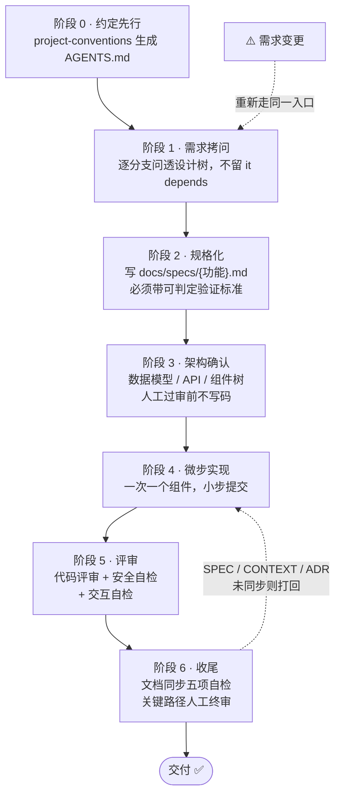

# project-conventions

**项目编码约定生成器**：一个完全自包含、可移植的 Agent Skill。AI 通过逐领域追问与你对齐编码偏好，最终在仓库根目录生成一份单文件中文 `AGENTS.md`，作为所有 AI 编码代理（Claude Code / Codex / Cursor / zcode / deepseek harness 等）共同遵守的项目约定。

一句话：**把约束变成文件，把决策留给拷问，让每个 agent 第一次就写对。**

## 它解决什么问题

vibe coding 的最大痛点不是 AI 写不出代码，而是**每次会话都要重新口头交代规矩**：不交代就自由发挥，交代多了上下文爆炸。本技能把"规矩"一次性谈判定稿、固化成 `AGENTS.md`，此后任何 agent 读这一份文件就知道规矩、路标和流程。

## 核心特性

### 1. 生成器，不是资料库
技能不内置一套写死的约定，而是一个**谈判流程**：AI 按领域展示有主见的默认约定，你逐批确认（每轮回复"全收 / 改第 N 条 / 补充"即可），定稿零 "it depends"。

### 2. 八大领域，条条有立场
界面、交互、后端与架构、数据与 API 契约、健壮性、安全、测试策略、工程规范。每条默认约定都具体可执行，例如：

- 客户端校验只为即时体验，最终以服务端校验为准
- 异步按钮 loading 必须在 `finally` 中重置，禁止任何路径卡死
- 禁止"仅改本地状态不调接口"的假保存
- SQL 一律参数化，密钥绝不进前端代码
- 独立异步操作必须 `Promise.all` 并行（React 栈附加包）

### 3. 三张地图（防"地图腐化"设计）
定稿的 `AGENTS.md` 内嵌三张**路由式地图**——只写规则和入口，不枚举文件清单（清单两周就变成谎言，规则不会）：

| 地图 | 管什么 |
|---|---|
| 文档地图 | 写/改某功能前必读哪份 SPEC，决策记录在哪 |
| 代码地图 | 入口文件、目录路由规则（新代码放哪）、关键数据流主线、外部集成点 |
| 测试地图 | 测试位置与命名、运行命令三件套（单测 / 全量+lint / typecheck）、fixture 位置、补测时机 |

### 4. 内置六阶段工作流程
`AGENTS.md` 自动带工作流程章节，六个阶段一条箭头走到底，需求变更则回到起点闭环：



### 5. 文档同步纪律（防文档腐化）
需求变更与新建走同一入口；SPEC 按功能拆文件；ADR 只追加不改旧（`superseded by ADR-NNNN`）；变更收尾前五项一致性自检，**未完成自检不得交付**。

### 6. 栈附加包机制
React/Next.js 性能铁律、复杂业务后端 DDD 铁律等，仅在技术栈命中时注入，避免约定膨胀。

### 7. 双模式
- **新项目**：问清技术栈后逐领域开问
- **现有项目**：先扫代码库，按现状提议约定，冲突项单独标注；已有 `AGENTS.md` 时走增量更新，不覆盖你的自定义内容

### 8. 完全可移植
**单个自包含 `SKILL.md`**，零平台专属工具、零绝对路径，只依赖"读写文件 + 对话"。

## 安装

### Claude Code / 任何支持 skills 的 agent

把整个文件夹（其实只有一个 `SKILL.md`）拷入技能目录：

```bash
# Claude Code
cp SKILL.md ~/.claude/skills/project-conventions/SKILL.md

# 或任意 agent 的 skills 目录
cp SKILL.md <agent-skills-dir>/project-conventions/SKILL.md
```

### 不支持 skills 的 agent

把 `SKILL.md` 正文整段贴进系统提示词即可，流程照跑。

### WorkBuddy

放入 `~/.workbuddy/skills/project-conventions/`，新会话说 **"给这个项目建 AI 约定"** 即触发。

## 使用

1. 在项目根目录启动 agent，触发技能
2. 告知技术栈（或让它扫描现有代码）
3. 按 8 轮逐领域确认默认约定
4. 得到仓库根目录的 `AGENTS.md`，从此每个 agent 开场一句：**"先读 AGENTS.md，然后我们做 XX"**

## 生成的 AGENTS.md 结构

```
# {项目名} 编码约定
## 1. 界面        ## 5. 健壮性
## 2. 交互        ## 6. 安全
## 3. 后端与架构   ## 7. 测试策略
## 4. 数据与 API 契约 ## 8. 工程规范
## 文档地图 / 代码地图 / 测试地图
## 工作流程（六阶段）
## 文档同步（需求变更时强制执行）
## 附：个性化说明
```

配套的仓库文档结构（技能会引导建立）：

```
/
├── AGENTS.md          # 薄入口：约定 + 地图 + 工作流程
├── CONTEXT.md         # 术语表
└── docs/
    ├── specs/         # 功能需求 + 验收标准，按功能拆文件
    ├── design/        # 概要设计（稳定层）
    ├── adr/           # 架构决策记录，只追加
    └── manual/        # 面向人类的操作手册
```

## 设计原则

- **路由式，不写清单**：地图只写规则与入口，文件枚举交给 agent 现场扫描
- **薄 AGENTS.md**：约定文件每次会话都被读，按"不写这条 AI 会犯错吗"的标准取舍
- **内嵌优先，超限才拆**：地图单节超 30 行才拆到 `docs/maps/`
- **零依赖**：不要求任何 MCP、插件或特定运行时

## License

MIT
